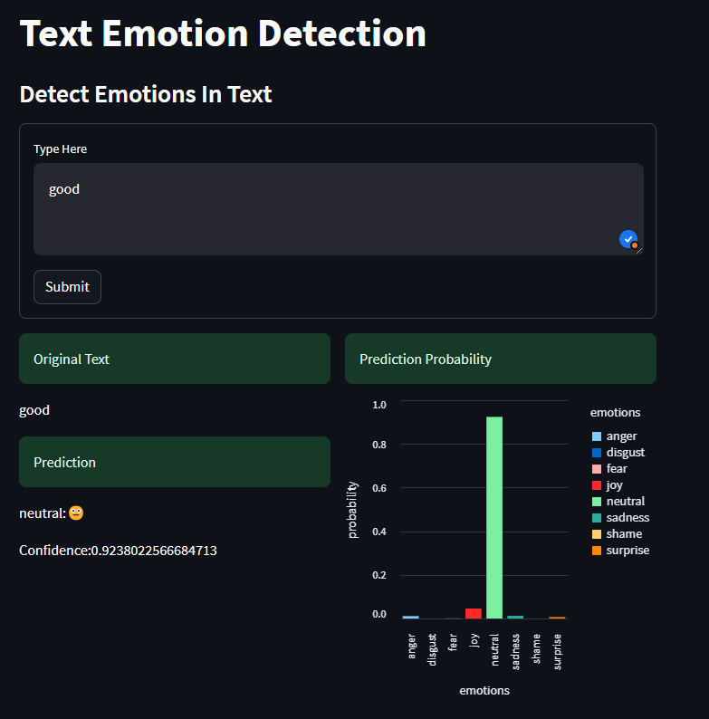

# 🧠 Text Emotion Detection App

A lightweight web app that detects emotions in text — joy, sadness, anger, surprise, and more — using a trained machine learning model and a simple, intuitive interface.

Built with 🐍 Python, 💡 Scikit-learn, and 🚀 Streamlit.

---

## 🌍 Live App

Try it here 👉 [Text Emotion Detection App](https://text-emotion-detection-hmrsmbqfw7qw6zwgkhhx4z.streamlit.app/)

---

## 🚀 What It Does

- Takes any short text input (e.g., tweet, sentence)
- Predicts the emotion behind it (joy, anger, sadness, etc.)
- Displays confidence with emoji and interactive chart
- Supports CSV upload for batch predictions

---

## 🧰 Tech Stack

| Tool           | Role                            |
|----------------|----------------------------------|
| Python         | Core programming                |
| Streamlit      | Frontend web app                |
| Scikit-learn   | ML pipeline + model             |
| TfidfVectorizer| Text feature extraction         |
| LogisticRegression | Emotion classification     |
| Altair         | Confidence bar chart            |
| NeatText       | Text cleaning                   |
| Joblib         | Save/load trained model         |
| Docker         | Containerization (optional)     |

---

## 📂 Project Structure

```
text-emotion-detection/
├── app.py                   # Streamlit app interface
├── text_emotion_model.pkl   # Trained ML model (must be present in root)
├── emotion_dataset_raw.csv  # Labeled training data
├── requirements.txt         # Dependencies for deployment
├── streamlit.yaml           # UI theming for Streamlit Cloud
├── Text Emotion Detection.ipynb # Jupyter notebook for training
├── text_emotion_detection.py    # Training script (optional)
├── screenshots/
│   └── app_screenshot.png   # Optional screenshot for README
```

---

## 💡 How It Works

1. The user enters a sentence or uploads a CSV
2. Text is cleaned using NeatText
3. The model (Tfidf + LogisticRegression) predicts the emotion
4. Result is displayed with emoji and confidence chart

---

## 📦 Installation

```bash
git clone https://github.com/dajuctech/text-emotion-detection.git
cd text-emotion-detection

# Set up virtual environment
python -m venv .venv
source .venv/bin/activate   # On Windows: .\.venv\Scripts\activate

# Install dependencies
pip install -r requirements.txt

# Run the app
streamlit run app.py
```

---

## 🌐 Streamlit Cloud Deployment

1. Push your code to GitHub
2. Go to https://streamlit.io/cloud
3. Sign in with GitHub → "New App"
4. Fill in:
   - Repository: `dajuctech/text-emotion-detection`
   - Branch: `main`
   - File: `app.py`

5. Deploy and share the link 🎉

---

## 🐳 Docker Support

To run in a Docker container:

```bash
docker build -t emotion-detector .
docker run -p 8501:8501 emotion-detector
```

---

## ✅ Requirements

Sample `requirements.txt`:

```
streamlit==1.32.0
pandas
numpy
altair
joblib
scikit-learn
neattext
```

---

## 📸 Demo Preview



---

## 🙌 Credits

- Model trained using classic ML (Tfidf + Logistic Regression)
- UI powered by Streamlit
- Text cleaning with NeatText
- Deployed on Streamlit Cloud

---

## 👨‍💻 Author

Built with care by Jude Daniel Chigozie  
🔗 GitHub: [@dajuctech](https://github.com/dajuctech)  
🌐 Live App: [text-emotion-detection.streamlit.app](https://text-emotion-detection-hmrsmbqfw7qw6zwgkhhx4z.streamlit.app/)

---

## 📄 License

MIT License. Feel free to use, modify, and share.

---

Enjoy using the app! Let it help you read between the lines. 😉
